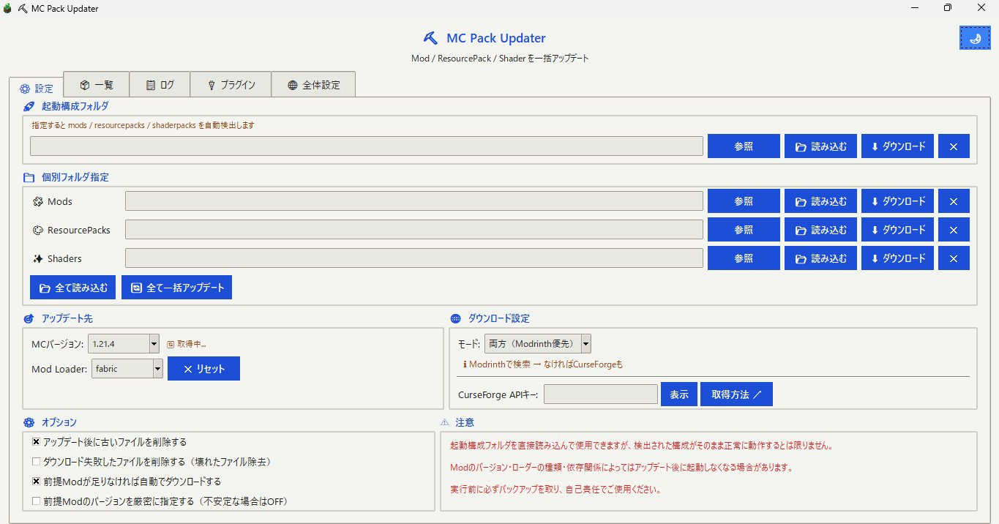
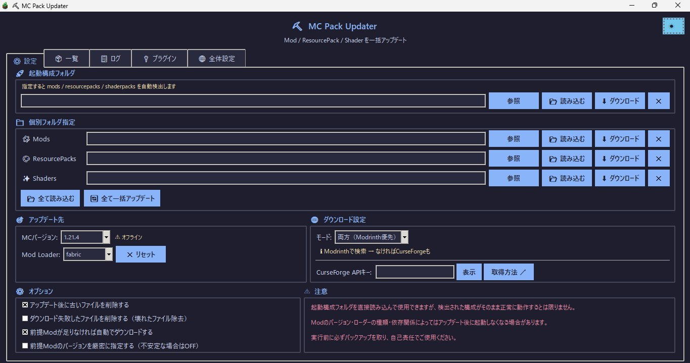

# ⛏ MC Pack Updater


<table><tr>
<td></td>
<td></td>
</tr>
<tr>
<td align="center">☀️ ライトモード</td>
<td align="center">🌙 ダークモード</td>
</tr></table>

Minecraft の Mod / ResourcePack / Shader / Plugin を一括アップデートするツール。

## ダウンロード

→ **[Releases](../../releases)** から最新版をダウンロード

| ファイル | 説明 |
|---|---|
| `MC-Pack-Updater.zip` | 推奨。解凍してフォルダ内の `MC-Pack-Updater.exe` を実行 |
| `MC-Pack-Updater.exe` | 単体EXE。SmartScreenの警告が出る場合あり |

## 使い方

### Mod / ResourcePack / Shader

1. `MC-Pack-Updater.exe` を起動
2. **⚙ 設定タブ** で起動構成フォルダ or 個別フォルダを指定
3. MCバージョン・Mod Loaderを選択
4. ダウンロードモードを選択
5. **「📂 全て読み込む」** で一覧に表示
6. **📦 一覧タブ** で更新したいものにチェック
7. 必要に応じてバージョンを個別指定（右サイドパネル）
8. **「⬇ アップデート」** または **「🔄 全て一括アップデート」**

> ⚠ 起動構成フォルダを直接読み込んで使えますが、その起動構成がそのまま使えるとは限りません。念のためバックアップを取った後にアップデートしましょう。

### Plugin

1. **🔌 プラグインタブ** を開く
2. **⚙ 設定** で `plugins` フォルダを指定
3. **Plugin Loader** プルダウンでサーバーの種類を選択
4. **「📂 読み込む」** でプラグイン一覧を表示
5. 更新したいプラグインにチェック
6. 必要に応じて右サイドパネルでバージョンを指定
7. **「⬇ ダウンロード」**

> ⚠ プラグインはModrinthからダウンロードします。お使いのMinecraftサーバーのバージョンやPlugin Loader（Spigot / Paper / Purpur / Velocity等）で正常に動作するとは限りません。必ずバックアップを取ってからご使用ください。

> ⚠ Plugin Loaderに「すべて（自動）」を選択した場合、Plugin Loader用（Spigot/Paper等）とプロキシ用（Velocity/BungeeCord等）のプラグインが混在してダウンロードされる場合があります。サーバーの種類に合わせて適切なLoaderを選択することを推奨します。

### プラグイン検査

プラグインフォルダ内のJARファイルがPlugin Loader用・プロキシ用のどちらに対応しているかをModrinthで確認できます。

1. **🔌 プラグインタブ → 🔍 検査** を開く
2. フォルダを指定して **「🔍 検査」** を実行
3. 各プラグインの対応Loaderと判定（Plugin Loader / プロキシ / 混在 / 不明）が表示される

### バックアップモード

**🌐 全体設定タブ** でバックアップモードを有効にすると、元のファイルを上書きせず別フォルダへ出力できます。

1. **🌐 全体設定タブ** を開く
2. 「バックアップモードを有効にする」をチェック
3. 「参照」で出力先フォルダを選択
4. 通常通りアップデートを実行

アップデートを実行すると、出力先フォルダに以下の構造でファイルが保存されます。

```
[出力先]/
  # 単体アップデート時（種類ごとに個別実行）
  ├─ v1.21.4_mod_2025-06-03_14-30-25/        ← Mod 単体（直下にJARを出力）
  ├─ v1.21.4_rp_2025-06-03_14-35-00/         ← ResourcePack 単体（直下にZIPを出力）
  ├─ v1.21.4_shader_2025-06-03_14-40-00/     ← Shader 単体（直下にZIPを出力）

  # 一括アップデート時（「全て一括アップデート」実行）
  ├─ v1.21.4_2025-06-03_14-30-25/            ← Mod / ResourcePack / Shader 一括
  │    ├─ mods
  │    ├─ resourcepacks
  │    └─ shaderpacks

  # Plugin（常に直下に出力）
  └─ plugin_2025-06-03_14-30-25/
```

> 親フォルダ名はアップデート実行時の **バージョン・日付・時刻** で自動生成されます。実行のたびに別フォルダが作られるため上書きされません。

## 起動構成フォルダについて

`.minecraft` 内の起動構成フォルダ（例: `C:\Users\owner\AppData\Roaming\.minecraft\fabric\1.21.4`）を指定すると `mods/` `resourcepacks/` `shaderpacks/` を自動検出して一括読み込みできます。

## 対応ダウンロード元

| コンテンツ | サービス | APIキー |
|---|---|---|
| Mod / ResourcePack / Shader | Modrinth | 不要 |
| Mod / ResourcePack / Shader | CurseForge | 必要 |
| Plugin | Modrinth | 不要 |

### CurseForge APIキーの取得

設定タブの「取得方法 ↗」ボタンを押すと案内が表示されます。または [https://console.curseforge.com/](https://console.curseforge.com/) から取得してください。

## 対応 Mod Loader

| Loader | 最小MCバージョン |
|---|---|
| Fabric | 1.14 |
| Forge | 1.1 |
| NeoForge | 1.20.1 |

## SmartScreen の警告について

初回起動時に「Windows によって PC が保護されました」という警告が表示される場合があります。

これは本ツールが**悪質なソフトウェアであるということではありません**。以下の理由により、無名の配布者が作成したEXEファイルには自動的に警告が表示されます。

**原因**

- WindowsのSmartScreenは、ダウンロード数・配布実績が少ないEXEを「信頼の実績がない」と判断して警告を出す仕組みになっています
- `デジタル署名`を取得・適用していないため、発行元が「不明な発行元」と表示されます
- PyInstallerでビルドしたEXEは構造上、一部のセキュリティソフトに誤検知されやすい特性があります

本ツールは以下の条件がすべて重なっており、誤検知が発生しやすい構成となっています。

- PyInstallerでexe化している
- urllib でインターネットからファイルをダウンロードする
- zipfile で圧縮ファイルを展開する
- ダウンロードしたファイルでローカルファイルを上書き・更新する

これらは単体では問題ない処理ですが、組み合わさることでセキュリティソフトが「マルウェアに似た挙動」と判断しやすくなります。

**回避方法**

警告画面で「詳細情報」→「実行」をクリックすることで起動できます。

> 心配な方はソースコードをご確認ください。

## 機能一覧

- 起動構成フォルダを1つ指定で全自動検出
- Mod / ResourcePack / Shader それぞれ個別または一括アップデート
- プラグインの一括アップデート（Modrinth）
- **Plugin Loader選択**（Spigot / Paper / Purpur / Velocity等を個別指定、混在防止）
- **プラグイン検査タブ**（JARがPlugin Loader用・プロキシ用・混在のどれかをModrinthで確認）
- **バックアップモード**（元ファイルを上書きせず、バージョン・日付・時刻名のフォルダへ出力）
- バージョン個別指定（サイドパネル）
- 前提Mod・前提プラグインの自動ダウンロード
- ダウンロード失敗ファイルの自動削除オプション
- A-Z順表示
- ダウンロード中止ボタン
- ライト / ダークモード切り替え
- トースト通知（読み込み完了時）
- 設定の自動保存

## 免責事項

本ツールの使用によって生じたいかなる損害についても、作者は一切の責任を負いません。自己責任でご使用ください。本ツールはMinecraftおよび各Modの公式ツールではありません。Mojang Studios、CurseForge、Modrinthとは一切関係ありません。

## 開発について

このツールのコードはすべてAI（Claude）に書いてもらいました。

## 更新履歴

### v1.3.1
- 「すべて」系Loader選択時の混在警告文をLoader種別に合わせて個別化

### v1.3.0
- プラグインタブにPlugin Loader選択プルダウンを追加（Spigot / Paper / Purpur / Velocity / BungeeCord等）
- 「すべて（自動）」選択時にPlugin Loader用とプロキシ用の混在警告を表示
- 🔍 検査タブを追加（JARのメタファイルを解析して対応Loaderを表示、API不要）

### v1.2.1
- プラグインタブの進捗バー統合

### v1.2.0
- バックアップモード追加
- 日英i18n対応

